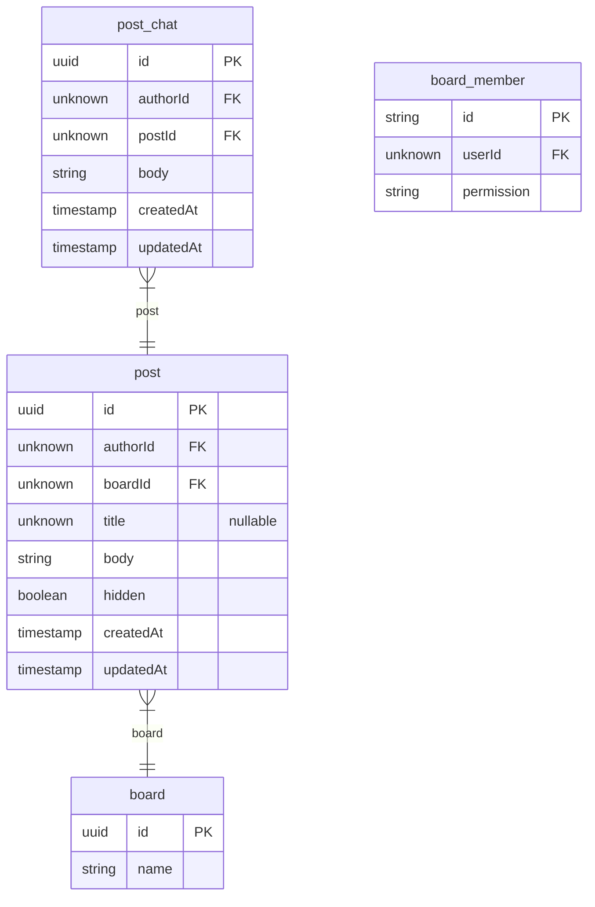
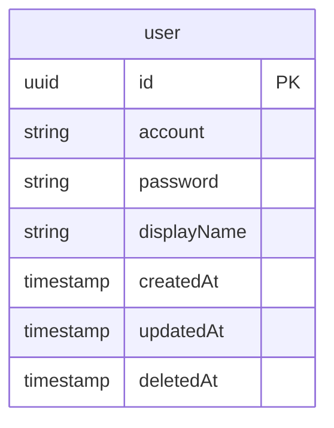

# Community

- [Board](#Board)
- [User](#User)

## Board

### post_chat
게시판 게시글 댓글.

**Columns**
- `id`
- `authorId`
- `postId`
- `body`
- `createdAt`
- `updatedAt`

### board_member
게시판 구성원.

**Columns**
- `id`
- `userId`
- `permission`

### board
게시판.

**Columns**
- `id`: Primary Key
- `name`: 게시판 이름

### post
게시판 게시글.

**Columns**
- `id`
- `authorId`
- `boardId`
- `title`
- `body`
- `hidden`
- `createdAt`
- `updatedAt`

## User

### user
사용자.

**Columns**
- `id`: Primary Key
- `account`: 계정 ID
- `password`: 비밀번호
- `displayName`: 이름
- `createdAt`: 생성일
- `updatedAt`: 수정일
- `deletedAt`
  > 삭제일.
  > 
  > 삭제일이 있다는 것은 탈퇴를 의미한다.

