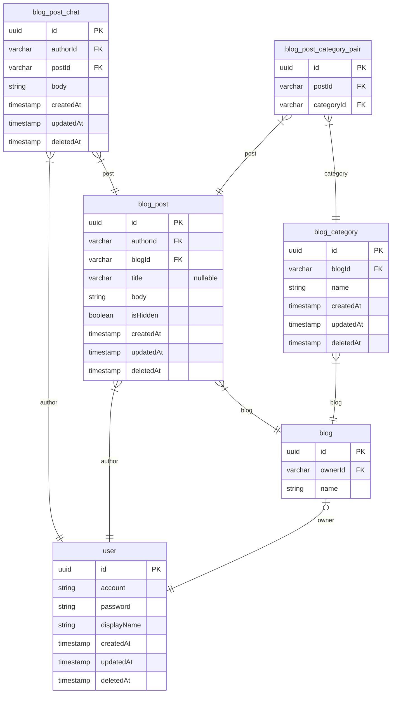
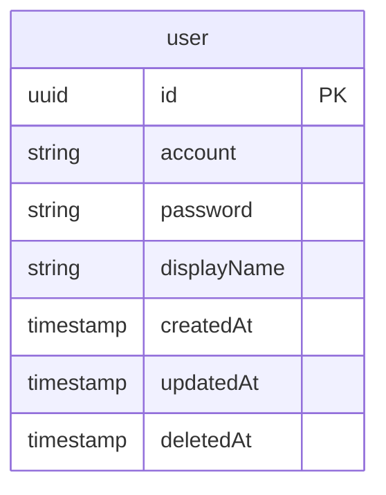
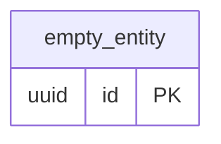

# My Blog

- [Blog](#Blog)
- [User](#User)
- [Default](#Default)

## Blog

### blog_post_chat
블로그 게시글 댓글.

**Columns**
- `id`: Primary Key
- `authorId`
  > 댓글을 작성한 User ID
  > 
  > Belonged user's [user.id](#user)
- `postId`
  > 댓글이 속한 BlogPost ID
  > 
  > Belonged blog_post's [blog_post.id](#blog_post)
- `body`: 내용
- `createdAt`: 작성일
- `updatedAt`: 수정일
- `deletedAt`: 삭제일

### blog_post_category_pair
BlogPost, BlogCategory N:M 테이블

**Columns**
- `id`: Primary Key
- `postId`: Belonged blog_post's [blog_post.id](#blog_post)
- `categoryId`: Belonged blog_category's [blog_category.id](#blog_category)

### blog_category
블로그 카테고리.

**Columns**
- `id`: Primary Key
- `blogId`
  > 카테고리가 속한 Blog ID
  > 
  > Belonged blog's [blog.id](#blog)
- `name`: 카테고리 명
- `createdAt`: 생성일
- `updatedAt`: 수정일
- `deletedAt`: 삭제일

### blog
블로그.

블로그는 각 유저별로 하나씩 소유가 가능하며
사용자가 작성한 게시글을 모아서 보여준다.

**Columns**
- `id`: Primary Key
- `ownerId`
  > 블로그 관리자 User ID
  > 
  > Belonged user's [user.id](#user)
- `name`: 블로그 이름

### blog_post
블로그 게시글.

**Columns**
- `id`: Primary Key
- `authorId`
  > 게시글 작성자 User ID
  > 
  > Belonged user's [user.id](#user)
- `blogId`
  > 게시글이 속한 Blog ID
  > 
  > Belonged blog's [blog.id](#blog)
- `title`: 제목
- `body`: 내용
- `isHidden`: 숨김 여부
- `createdAt`: 작성일
- `updatedAt`: 수정일
- `deletedAt`: 삭제일

## User

### user
사용자.

**Columns**
- `id`: Primary Key
- `account`: 계정 ID
- `password`: 비밀번호
- `displayName`: 이름
- `createdAt`: 생성일
- `updatedAt`: 수정일
- `deletedAt`
  > 삭제일.
  > 
  > 삭제일이 있다는 것은 탈퇴를 의미한다.

## Default

### empty_entity
Empty Entity.

**Columns**
- `id`

